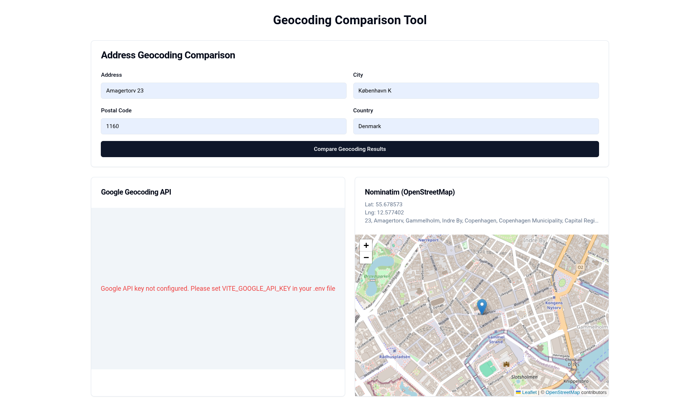

# Geocoding Comparison Tool

A React application that compares geocoding results from Google Geocoding API and Nominatim (OpenStreetMap).




## Features

- Input form with Address, City, Postal Code, and Country fields
- Side-by-side map comparison using react-leaflet
- Displays coordinates and formatted address for each API
- Uses OpenStreetMap tiles for both maps
- Parallel API requests for faster results
- Error handling for both APIs

## Setup

1. Install dependencies:
   ```bash
   pnpm install
   ```

2. Create a `.env` file from the example:
   ```bash
   cp .env.example .env
   ```

3. Add your Google Geocoding API key to the `.env` file:
   ```
   VITE_GOOGLE_API_KEY=your_api_key_here
   ```
   
   You can get a Google Geocoding API key from: https://developers.google.com/maps/documentation/geocoding/get-api-key

4. Start the development server:
   ```bash
   pnpm dev
   ```

## Usage

1. Fill in the address form with:
   - Address (street address)
   - City
   - Postal Code
   - Country

2. Click "Compare Geocoding Results"

3. View the results:
   - **Left side**: Map centered on Google Geocoding API results
   - **Right side**: Map centered on Nominatim (OpenStreetMap) results
   - Both maps display the coordinates and formatted address

## Technologies Used

- React + TypeScript + Vite
- shadcn/ui for UI components
- react-leaflet for maps
- Tailwind CSS for styling
- Google Geocoding API
- Nominatim OpenStreetMap API

## Notes

- The Nominatim API is used for demonstration/testing purposes only
- For production use, consider implementing rate limiting and caching
- Both APIs may have different rate limits and usage policies
